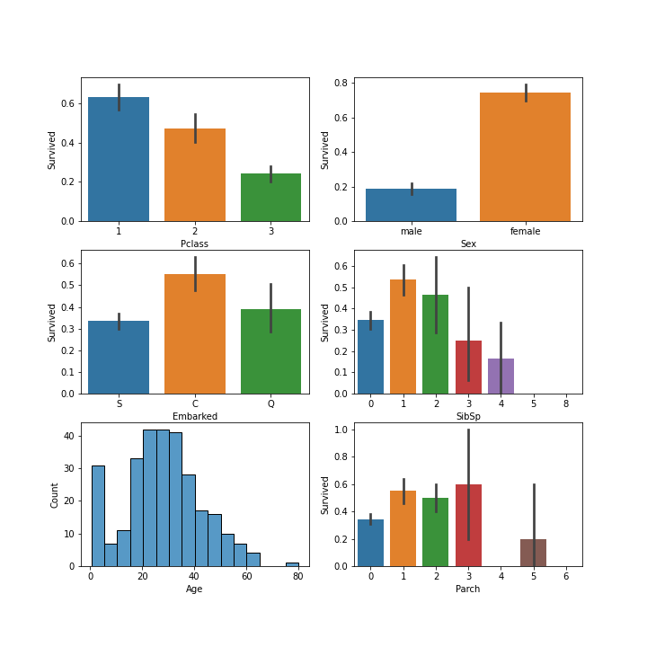
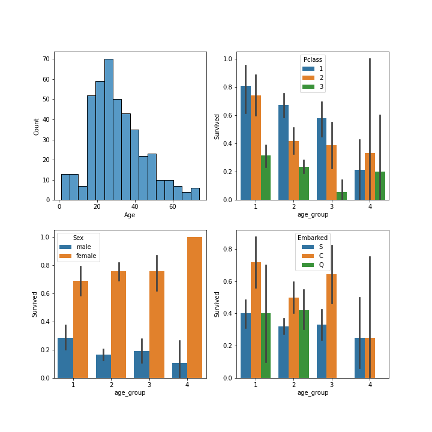

# Titanic
Titanic ML Disaster

# Feature Engineering

-  We have filled NA values in `Age` column in train data using median.
- `Fare` missing value in test is filled using median.
-  Cabin missing values are filled with `X` character.
-  We create `age_group` column and divide age into 4 groups `Age <= 20` , ` 20 < Age <= 40`, `40 < Age <= 60` and `Age > 60`
-  We create `fare_group` column based upon mean of Fare for each `Pclass`.
-  We create one hot encoding for Embarked column.
-  Combined the `Sibsp` and `Parch` column into `Family` and `Alone` and then divided into family groups based upon survival rate.
-  Mapped `Male` and `Female` in `Sex` column to 0 and 1.

# Exploratory Analysis

**Observations**

1. Pclass == 1 has highest probability of surviving.
2. Females have higher chance of survival.
3. Passengers from C station have higher chance of survival.
4. People with Sibsp 1 and 2 have better chance of survival.
5. People between age 20 and 40 and infants have higher count in survived passengers.
6. Parch column with 1,2,3 has similar chance of survival.

Since there is not much conclusive evidence from plot 4 and 6, we will engineer features from Parch and Sibsp column into Family and Alone columns.
Embarked has 2 missing values, we fill them depending on their Survival class. 

7. From 5 we know that between 20 and 40 years the survival rate is high. Similarly Death rate is also high between 20 and 40 years. This is because number of passengers on board the ship are mostly between 20 and 40 years.
8. After dividing into age groups and plotting the survival rate barplot for age_group with Pclass, all groups have higher survival rate for Pclass 1.
9. All age_group have higher survival rate in case of females.
10. Age group 4 have higher survival rate for passengers embarked from 'Q' station while others from 'C' station. This also might be due to NA values.

# Results

| Classifier | Val accuracy | Submission results |
|------------| ------------ | -------------------|
| Linear SVM |              |                    |
|Non-Linear SVM (RBF Kernel) | | |
| Non-Linear SVM (Linear Kernel) | | |
| Decision Tree | | |
| XGBoost | | |
| Random Forest | | |
| Neural Netwrok | | |

# References

1. https://www.kaggle.com/l3r4nd/titanic-prediction-with-svm
